# 📘 Late Comers – Real-Time Student, Staff & Visitor Management System

**Late Comers** is a professional real-time tracking and management system tailored for educational institutions. It efficiently monitors and manages late arrivals of students and staff, while also handling live visitor registrations with secure barcode passes. The system features automated SMS alerts to parents, detailed analytics, suspension tracking, bulk uploads, and daily email reports for administrators. Through centralized dashboards and intelligent automation, Late Comers enhances campus discipline, transparency, and security.

---

## 📊 Dashboard

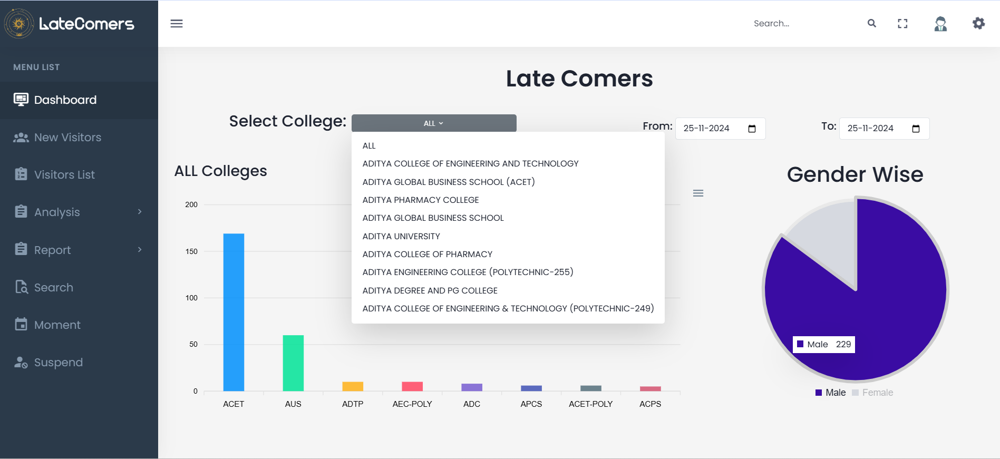

- Real-time overview of student/staff late entries.
- Summary views based on date, college, and visitors.

---

## 🚶 Visitor Management

### 📝 New Visitor Registration

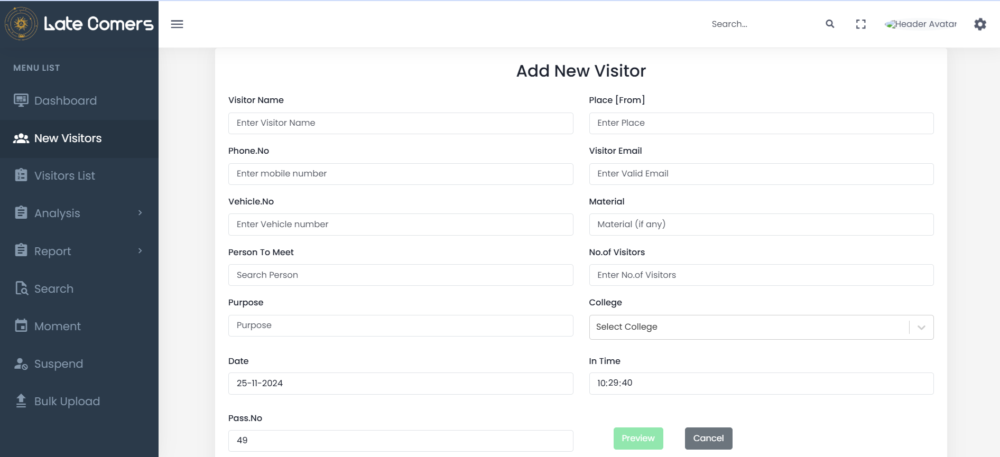

- Quick form to register new visitors.
- Captures key details like name, phone number, purpose, etc.

### 🪪 Barcode-based Visitor Pass

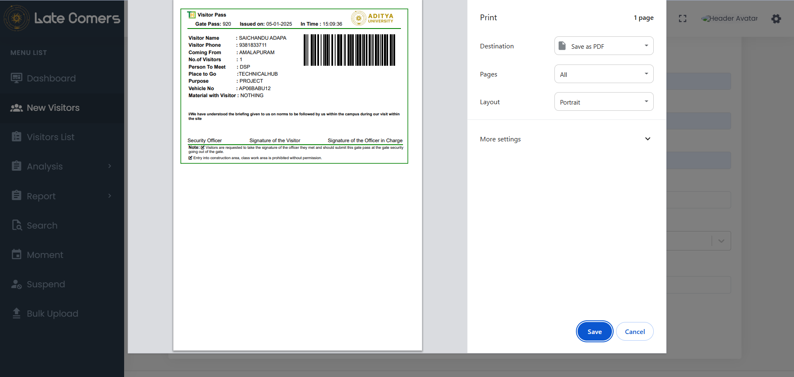

- Generate passes with scannable barcodes.
- Controls campus access securely and efficiently.

### 📋 Visitor Logs

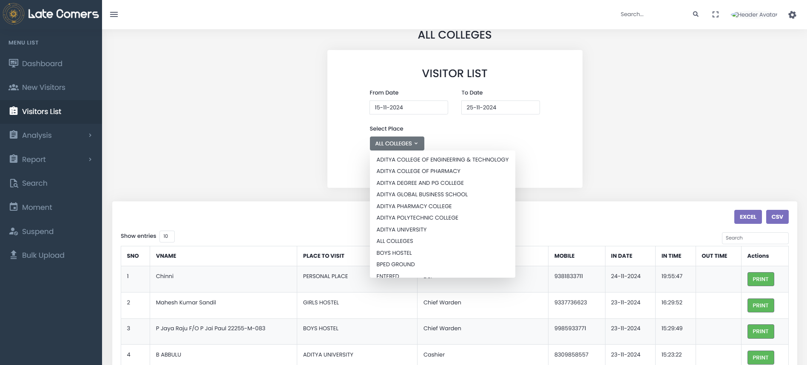

- Check visitor history filtered by date/location.
- Exportable as Excel/CSV.

---

## 👨‍🎓 Student & Staff Analytics

### 🏫 College-Wise Analysis

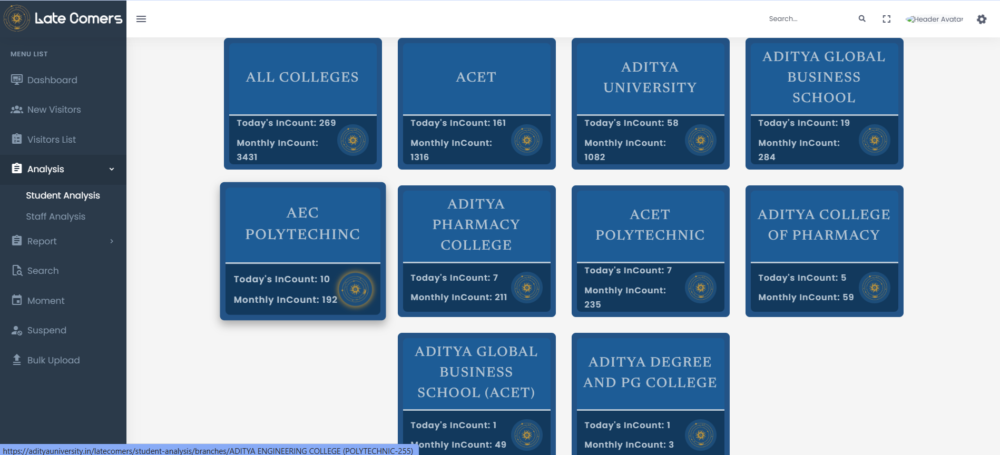

- Statistics of latecomers per college.
- Daily and monthly summaries.

### 🏛️ Branch-Wise Analysis

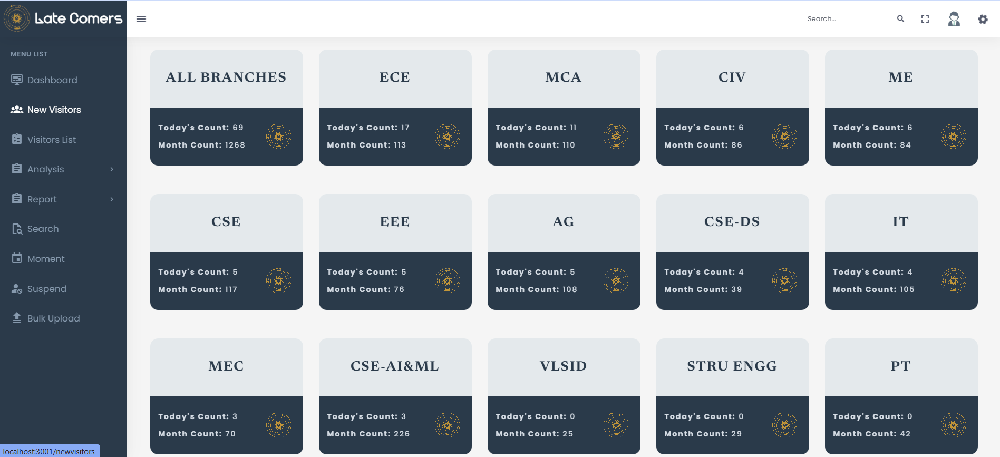

- Deep-dive into departmental trends.
- Identifies frequently late students.

---

## 👤 Individual Student Details

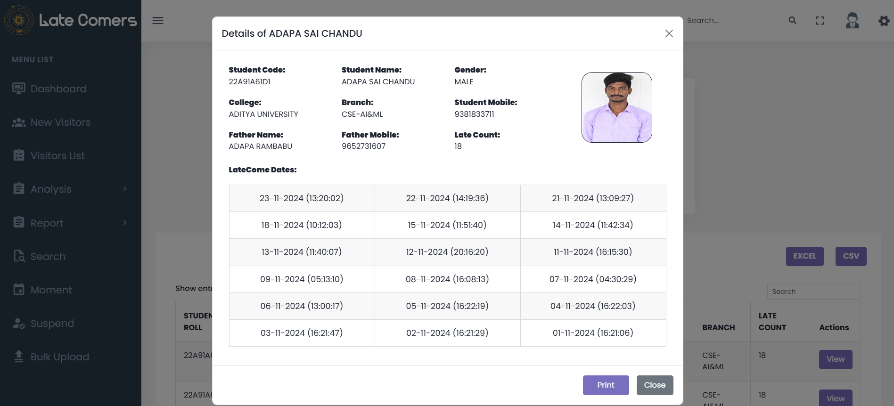

- View specific student entries by date.
- Supports Excel/CSV export.

---

## 📑 Reports Generation

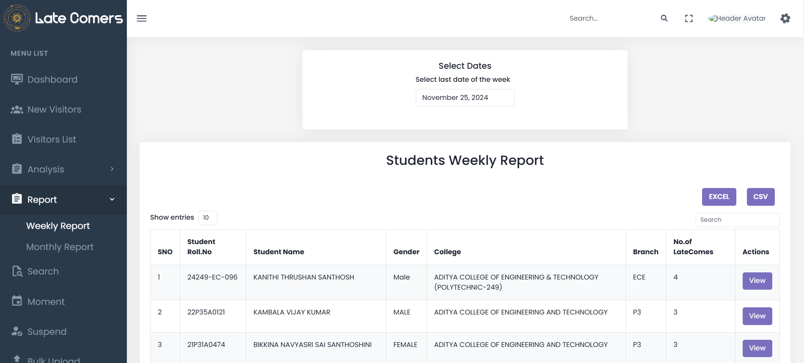

- Weekly: Students late >= 3 times.
- Monthly: Students late >= 10 times.
- Downloadable for admin use.

---

## 🔍 Search by Roll Number

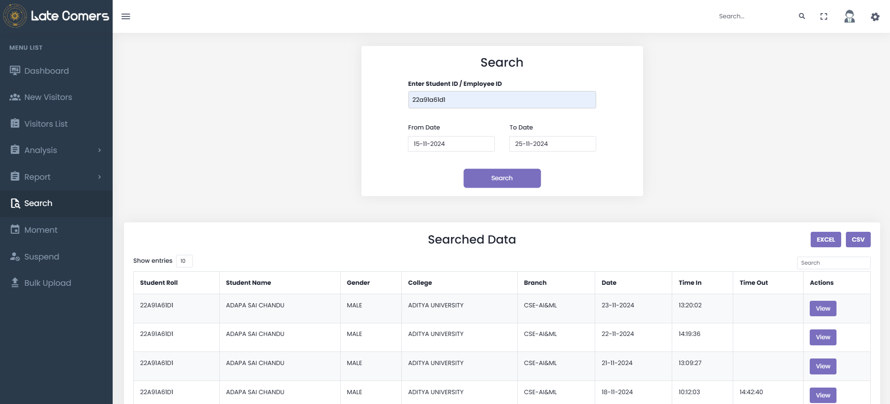

- Filter records by student roll number.
- See daily report of the specific student.

---

## 🕒 Real-Time Moments

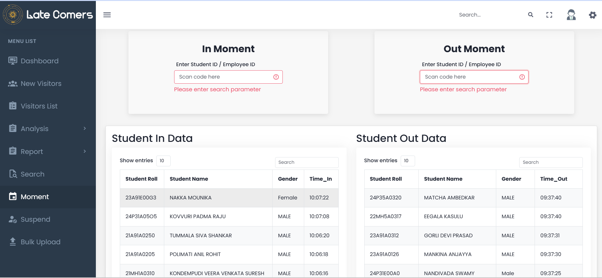

- Timestamps for each late entry.
- Sends instant SMS to parents.

---

## ❗ Suspended Student Pop-up

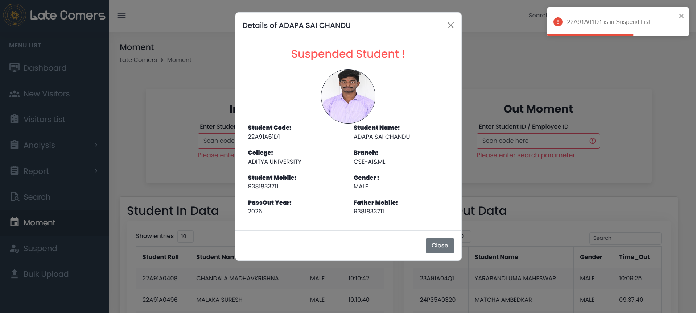

- Alert screen for suspended students when scanned.
- Enables on-the-spot enforcement.

---

## 📥 Bulk Upload System

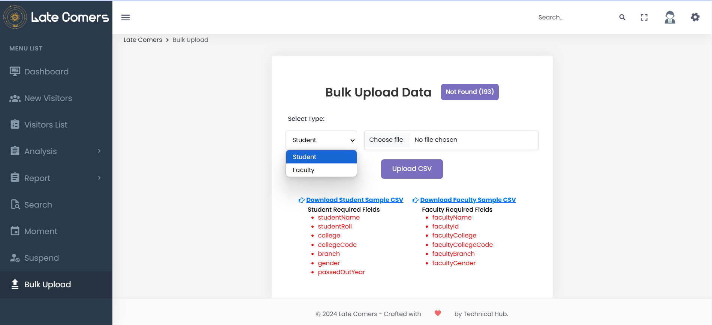

- Upload large datasets of students/staff via CSV.
- Structured templates for easy integration.

---

## 🚫 Suspension Management

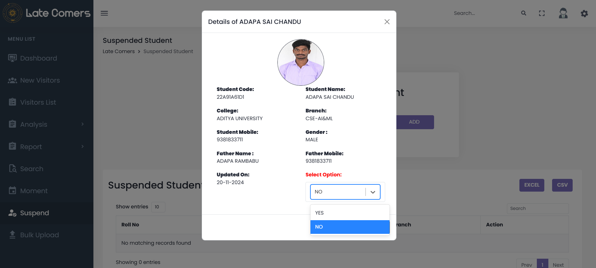

- Add/remove suspensions easily.
- Manage flagged individuals.

---

## 📧 Automated Email Reports

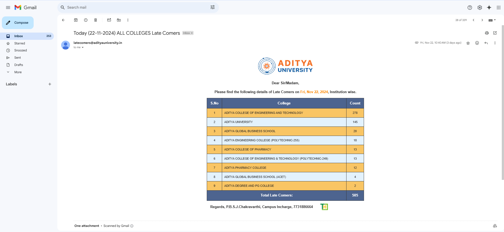

- Sends daily report emails with:
  - Total count.
  - College/branch-wise breakdown.
  - Excel/CSV attachments.

---

## 📲 SMS Notifications

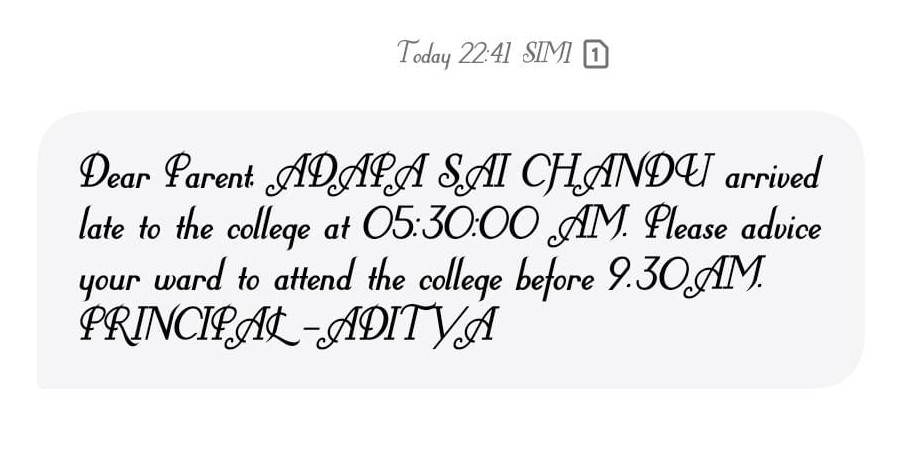

- Daily: Instant alerts to parents.
- Weekly: Repetitive defaulter reports.
- 15/30 Days: Summary messages.

---

## 📋 Visitor Last 7 Days Record

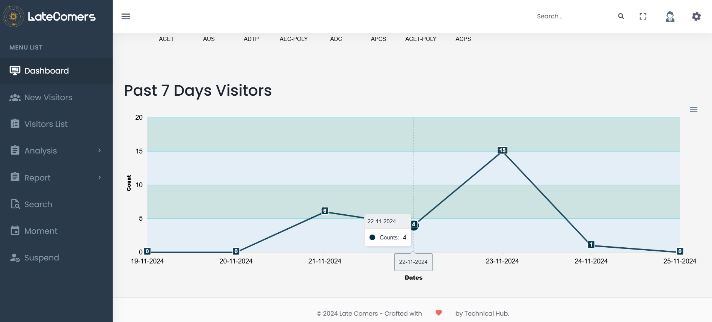

- View and manage previous week's visitor data.

---

## 📤 Admin Download Section

- Export all key reports.
- Includes summary data and raw logs.

---

## 🛠️ Tech Stack

- **Frontend**: ReactJS
- **Backend**: Node.js + Express
- **Database**: MongoDB
- **Services**: Twilio (SMS), Nodemailer (Emails), CSV Parser.

---
